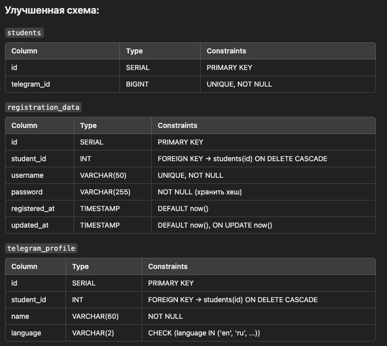

1. Репозиторий должен содержать микросервис для регистрации через телеграмм.

БД - общая. Докерфайл затем должен запускаться из основного приложения, но притом, мы оставляем тут файл для тестов.
в дальнейшем желательно реализовать "соль" для защиты данных в БД.
Схема для БД.

student
id primary_key 
telegram_id bigint

регистрационные данные:
id fk -> students.id
username VARCHAR(50)
password VARCHAR(50)
registrated_at datastamp
updated_at datastamp

telegram_profile:
id fk students.id
name VARCHAR(60) -> ##брать из телеграмма 
lagnuage VARCHAR(2) -> LANGUAGE/ telegram

по-хорошему добавить вместо states - redis отдельным контейнером

для миграции данных сделать alembic(пересмотреть то видео)

переписать с основного проекта регистрацию, сделать валидацию данных. 

добавляем связи один к одному и возможности на удаление 
чтобы в будущем не было лишней информации
